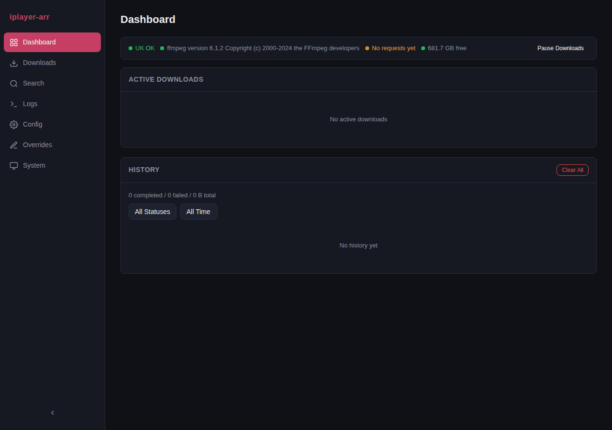

<p align="center">
  
</p>

BBC iPlayer download manager with a web UI, Sonarr integration, and built-in VPN support.

[](https://github.com/Will-Luck/iplayer-arr/actions/workflows/ci.yml)
[](https://github.com/Will-Luck/iplayer-arr/releases)
[](LICENSE)
[](https://github.com/Will-Luck/iplayer-arr/pkgs/container/iplayer-arr)



## Features

- Search and browse BBC iPlayer via the BBC IBL API
- Automatic HLS stream download with quality selection (720p/540p/396p)
- Download queue with configurable concurrent workers
- Newznab-compatible indexer for Sonarr
- SABnzbd-compatible download client API
- Real-time dashboard with SSE live progress
- Built-in WireGuard VPN via hotio base image (off by default)
- Setup wizard for first-run Sonarr configuration
- Episode identity resolution with per-show overrides
- System health monitoring (disk usage, ffmpeg status, geo check)

## Quick Start

```bash
docker run -d \
  --name iplayer-arr \
  -p 8191:8191 \
  -v iplayer-arr-config:/config \
  -v /path/to/downloads:/downloads \
  -e TZ=Europe/London \
  ghcr.io/will-luck/iplayer-arr:latest
```

Or with Docker Compose:

```yaml
services:
  iplayer-arr:
    image: ghcr.io/will-luck/iplayer-arr:latest
    container_name: iplayer-arr
    ports:
      - 8191:8191
    volumes:
      - iplayer-arr-config:/config
      - /path/to/downloads:/downloads
    environment:
      - TZ=Europe/London
    restart: unless-stopped

volumes:
  iplayer-arr-config:
```

> iPlayer requires a UK IP address. Enable the built-in VPN or run behind an existing UK VPN/proxy. See the [VPN Configuration](https://github.com/Will-Luck/iplayer-arr/wiki/VPN-Configuration) wiki page.

Open `http://localhost:8191` and the setup wizard will guide you through connecting Sonarr.

## Configuration

See the [Configuration Reference](https://github.com/Will-Luck/iplayer-arr/wiki/Configuration-Reference) for the full list of environment variables, application settings, and VPN options.

## Documentation

See the [Wiki](https://github.com/Will-Luck/iplayer-arr/wiki) for:

- [Installation](https://github.com/Will-Luck/iplayer-arr/wiki/Installation) (Docker, Compose, VPN setup)
- [Configuration Reference](https://github.com/Will-Luck/iplayer-arr/wiki/Configuration-Reference) (environment variables, settings)
- [Sonarr Integration](https://github.com/Will-Luck/iplayer-arr/wiki/Sonarr-Integration) (indexer and download client setup)
- [Web UI Guide](https://github.com/Will-Luck/iplayer-arr/wiki/Web-UI-Guide) (page-by-page walkthrough)
- [Episode Overrides](https://github.com/Will-Luck/iplayer-arr/wiki/Episode-Overrides) (fixing numbering mismatches)
- [REST API Reference](https://github.com/Will-Luck/iplayer-arr/wiki/REST-API-Reference)
- [Troubleshooting](https://github.com/Will-Luck/iplayer-arr/wiki/Troubleshooting)

## Licence

GPL-3.0. See [LICENSE](LICENSE).
